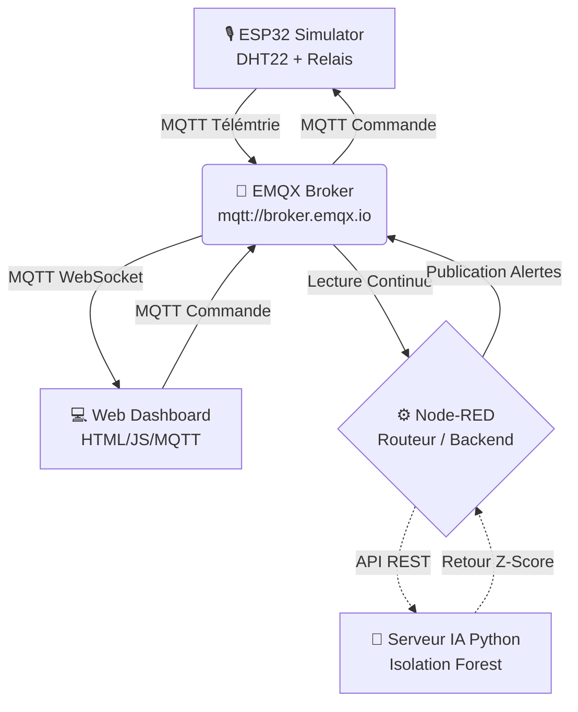

# 🏡 SmartHome AI Monitor

   

Un système professionnel de supervision et d'analyse prédictive pour l'habitat intelligent (Smart Home). Ce projet simule un environnement IoT avec une intégration de bout en bout : du capteur matériel (ESP32) jusqu'à un tableau de bord web interactif, propulsé par une Intelligence Artificielle (Machine Learning) qui détecte les anomalies en temps réel.

---

## 🎯 Problématique

**Comment monitorer, interagir et analyser de manière prédictive un environnement domestique pour prévenir les anomalies en temps réel, sans dépendre exclusivement d'un écosystème cloud fermé ?**

Les solutions domotiques traditionnelles sont souvent compartimentées, dépendantes d'applications spécifiques, et se contentent d'afficher des données brutes. Ce projet résout ce problème en proposant une architecture **modulaire, conteneurisée et intelligente** :
1. **Centralisation standardisée** : Utilisation du protocole MQTT universel pour centraliser la communication.
2. **Indépendance** : Une stack logicielle 100% locale (Docker) qui peut tourner sur n'importe quel ordinateur, serveur ou Raspberry Pi.
3. **Analyse Prédictive** : Au lieu de juste afficher "Il fait 35°C", une IA intégrée (algorithme de détection d'anomalies Isolation Forest) analyse la tendance et alerte instantanément d'un risque d'incendie ou de panne de système de refroidissement.

---

## 🏗️ Architecture du Projet

L'architecture repose sur 5 piliers principaux :



### Détail des composants
- **Le Capteur (Wokwi / ESP32)** : Il simule un environnement physique, captant la température/humidité et écoutant les ordres pour allumer ou éteindre ses relais.
- **Le Bus de Données (EMQX)** : Un broker MQTT public (ou local) qui distribue l'information en temps réel grâce au paradigme *Publish/Subscribe*.
- **Le Moteur de Règles (Node-RED)** : Il orchestre les flux, gère les alertes, stocke potentiellement l'historique et fait le pont avec l'intelligence artificielle.
- **Le Cerveau IA (Python Flask + Scikit-Learn)** : Un microservice dédié à l'ingestion des données environnementales pour calculer des scores de risque (Z-Score) et prédire une dérive thermique.
- **L'Interface Utilisateur (Nginx + HTML/Vanilla JS)** : Un dashboard web moderne, réactif, qui se connecte directement en WebSocket pour afficher les courbes en temps réel (Chart.js).

---

## 🚀 Installation & Lancement

Prérequis :
- **Docker Desktop** (avec l'intégration WSL2 configurée)
- Windows (ou Linux/Mac avec script shell équivalent)

### Étape 1 : Lancer l'écosystème Docker
Ouvrez un terminal dans le répertoire du projet et lancez le double script magique :
```bash
# Lance le broker MQTT, Node-RED, le serveur IA Python et le Dashboard web Nginx.
.\start.bat
```
Si vous êtes sous Linux ou Mac, exécutez directement : `docker compose up -d --build`.

> [!TIP]
> **Adresses Locales par défaut :**
> - **Dashboard Web** : [http://localhost:8080](http://localhost:8080)
> - **Node-RED** : [http://localhost:1880](http://localhost:1880)
> - **EMQX Admin** : [http://localhost:18083](http://localhost:18083) (si configuré en local)

### Étape 2 : Démarrer la Simulation Matérielle (ESP32)

Ce projet inclut une configuration automatique pour **Wokwi**, le simulateur IoT.
Pour lancer la simulation du matériel :
1. Installez l'extension **Wokwi Simulator** dans VS Code (ou utilisez le programme Node.js).
2. Lancez le fichier projet Wokwi via le fichier de configuration associé :
```bash
npx wokwi-cli --port 3200
```
Le simulateur se connectera au Broker public par défaut, et les données apparaîtront instantanément sur le Dashboard Web !

---

## 🛠️ Outils & Langages Utilisés
- **Conteneurisation** : Docker, Docker Compose
- **Iaas / Simulation** : Wokwi, MicroPython
- **Backend / Flux** : Node-RED, Node.js
- **Machine Learning** : Python, Flask, Scikit-Learn (Isolation Forest)
- **Frontend** : HTML5, Vanilla JavaScript, CSS3 (Design Glassmorphism), Chart.js
- **Messagerie** : MQTT (Protocole Standard & WebSocket)
